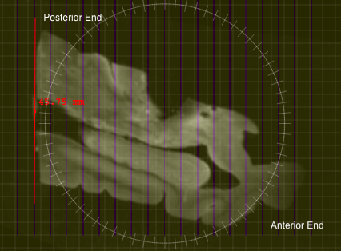

# 3D Printing

3D printing is used to create custom cutting molds from 7T MRI scans.
Prerequisites for this step are

-   A 7T scan of the whole MTL sample copied to your working computer.
-   Completed ITK-SNAP training from
    [*itksnap.org/rsna2017*](http://itksnap.org/rsna2017)
-   Install [ITKSNAP and C3D](http://itksnap.org) and [MeshLab](https://www.meshlab.net/)

## Step 1. Convert 7T scan to NIFTI

1.  Locate the folder containing the 7T scan.

2.  Create a work folder where the holder creation will take place

3.  Open the 7T DICOM image in ITK-SNAP

    -   Be sure to select series that **does** **not** end with "\_ND" (no distortion)

4.  Save the image in the work folder as **mtl7t.nii.gz**

## Step 2. Segment the MTL from background in ITK-SNAP

1.  Load **mtl7t.nii.gz** into ITK-SNAP

2.  Enter the automatic (snake) segmentation mode

    -   If you want to change the resolution of the image to make the program go faster, after clicking on the automatic segmentation button, click **"Resample ROI"** under within the inspect box

    -   When you hit "**Segment 3D**", click on "**Presets"** and choose **"Subsample by 2"**

    -   This will increase the voxel size, making the segmentation rougher but faster

3.  Enter "classification" pre-segmentation mode

4.  Label the tissue as "red" label, and background (fomblin) as "green"
    label
    -   If there is some water on top of the sample, label it with another label
    
    

5.  Under "More..." set the "Neighborhood size" to 2

    

6.  Very carefully train the classifier to isolate foreground from
    background

    -   Keep adding training samples at places where the classifier
        > messes up

7.  Save the classifier training samples as
    **"training\_samples.nii.gz"**

    -   This option is on the More...

8.  Add bubbles and run contour (snake) evolution. Verify that the
    segmentation is good.

    

9.  Before clicking "Finish", click "Layer Inspector..." (Tools -\>
    Layer Inspector...) and save the "**evolving contour" **layer as
    **"contour\_image.nii.gz"**

10.  Exit the segmentation mode. You do not need to save the actual
    segmentation.

## Step 3. Create a reference mold

The reference mold is a 3D image that looks like a brick with slits for
cutting. The actual mold will be carved out of the reference mold.

1.  Open a terminal

2.  Change directory to your work directory

3.  The reference mold is created using the following C3D command:

    a.  The first script is for a standard size sample

    b.  The second script is for a larger sample (10% larger mold). Try the first script, if the MTL cannot be rotated correctly in that mold use the larger reference mold.

        c3d -create 320x480x320 0.2x0.2x0.2mm -orient LPI -origin-voxel 50% \\
        -cmp -popas z -popas y -popas x \\
        -push y -scale 1.570796 -cos -acos -scale 0.318310 -thresh -inf 0.1 -4 4 \\
        -push z -thresh -inf -28 4 -4 -max -push y -thresh -40 40 -4 4 -max \\
        -pad 5x5x5 5x5x5 -4 -o reference\_mold.nii.gz
        
        c3d -create 352x528x352 0.2x0.2x0.2mm -orient LPI -origin-voxel 50% \\
        -cmp -popas z -popas y -popas x \\
        -push y -scale 1.570796 -cos -acos -scale 0.318310 -thresh -inf 0.1 -4 4 \\
        -push z -thresh -inf -28 4 -4 -max -push y -thresh -50 50 -4 4 -max \\
        -pad 5x5x5 5x5x5 -4 -o reference\_mold.nii.gz
        
        c3d -create 384x576x384 0.2x0.2x0.2mm -orient LPI -origin-voxel 50% \\
        -cmp -popas z -popas y -popas x \\
        -push y -scale 1.570796 -cos -acos -scale 0.318310 -thresh -inf 0.1 -4 4 \\
        -push z -thresh -inf -28 4 -4 -max -push y -thresh -60 60 -4 4 -max \\
        -pad 5x5x5 5x5x5 -4 -o reference\_mold.nii.gz

    FOR FRONTAL LOBES:

        c3d -create 460x775x460 0.2x0.2x0.2mm -orient LPI -origin-voxel 50% \\
        -cmp -popas z -popas y -popas x \\
        -push y -scale 1.570796 -cos -acos -scale 0.318310 -thresh -inf 0.1 -4 4 \\
        -push z -thresh -inf -28 4 -4 -max -push y -thresh -70 70 -4 4 -max \\
        -pad 5x5x5 5x5x5 -4 -o reference\_mold.nii.gz

    **NOTE:** To change the number of slits in the y direction change the "-40 40" line (ex. In the 20% larger mold more slits were added by changing it to "-50 50"). To change the depth of the slits alter the "-28" in the z direction.

    

## Step 4. Find the correct rotation of the 7T image

This step finds the main axis of the hippocampus and aligns it with one
of the canonical axes of the image. This allows the cutting mold to
follow the main axis of the hippocampus.

1.  Load `reference_mold.nii.gz` as the main image in ITK-SNAP

    -   Assign the _Spring_ color map to the reference mold

2.  Load `mtl7t.nii.gz` as the overlay image using `File->Add Another Image`.

    -   Click "As a semi-transparent overlay"

3.  Enter registration mode (`Tools->Registration`) and go to the _Manual_ tab

4.  Display the MRI scan as a semi-opaque overlay

    -   `Tools->Layer Inspector`

    -   Select the MRI layer

    -   Go to the _General_ tab

    -   Click _Display as semi-transparent overlay_ and set opacity to 85%

    

5.  Rotate and translate the MRI so that the sample is positioned well
    in the reference mold. This may require some practice to get right.
    Here are the general rules to follow:

    -   The tissue should be inside the "slitted" region of the reference mold. In other words, the bottom of the tissue should be above the line where the slits begin.

    -   The hippocampal main axis should be aligned with the A-P axis, but rotated so that the posterior end of the MTL is parallel to the slits in the mold

        -   This is with the assumption that during hemisphere cutting,
            the posterior end of the hemisphere is cut at an angle that
            is parallel to the AC-PC line, so that when you align the
            slits with the posterior end, the MTL will be cut
            perpendicular to the AC-PC line

        

6.  When looking at the coronal view, find a slice in the MRI where
    the tissue looks to be the largest, and measure the tissue to
    ensure that the largest portions of the tissue would fit on a
    75mm x 50mm glass slide (2"x3" slide)

    

7. The tissue should be centered in the mold on the L-R axis and A-P axis

8.  When satisfied use the floppy disk icon to save your registration as
    `holderrotation.mat`
    
9.  Make sure under format, "Convert3D Transform File" is selected

    

10.  Save your workspace as `workspace.itksnap`

## Step 5. Carve the tissue segmentation out of the mold

1.  This command carves out the tissue segmentation out of the mold. It
    generates an image that is positive inside the plastic mold and
    negative in the air.

        c3d reference\_mold.nii.gz -as R contour\_image.nii.gz -background 4 \\
        -reslice-matrix holderrotation.mat \\
        -swapdim IPL -extrude-seg -swapdim LPI \\
        -push R -min -o slitmold.nii.gz

2.  Trim the mold in ITK-SNAP

    -   Open `slitmold.nii.gz` in a new ITK-SNAP window

    -   Load `mtl7t.nii.gz` as an additional image

    -   Enter registration mode and use the open icon to load `holderrotation.mat`

    -   Use the Crosshairs tool to position the cursor (horizontal blue
        line in the top right view in picture below) slightly superior
        to the top of the sample

    -   Click the Polygon tool and draw around the tissue but leaving
        out excess plastic:

        i.  Once polygon is drawn, click accept

        ii. Use Crosshairs tool again to position the cursor (same
            horizontal blue line) slightly below the bottom of the
            holder

        iii. Click the Polygon tool again, then click "paste last
             polygon" to draw the identical polygon in that slice

        iv.  Click accept again

        

    -   Interpolate between these polygons using `Tools->Interpolate Labels`

    -   Save the segmentation as `cropmask.nii.gz`

    -   Run following command to crop the block:

            c3d cropmask.nii.gz -pad 4x4x4 4x4x4 0 \\
            -stretch 0 1 -4 4 -dup slitmold.nii.gz \\
            -reslice-identity -min -o slitmold\_cropped.nii.gz

## Step 6. Generate Surface Mesh of the Mold

1.  This command generates a 3D surface mesh from the image above

        vtklevelset slitmold_cropped.nii.gz slitmold.stl 0.0

    OR if `vtklevelset` is not in your `/usr/local/bin`:

    -  Type `PATH=$PATH:/path/to/directory/bin` before the command (change
       `/path/to/directory/bin` to the path to the folder containing the
       `vtklevelset` executable)

           PATH=$PATH:/Applications/ITK-SNAP.app/Contents/bin/ 
           vtklevelset slitmold_cropped.nii.gz slitmold.stl 0.0

## Step 7. Simplify the STL file for 3D printing

1.  Run **Meshlab** and load `slitmold.stl` using `File->Import Mesh`

2.  Go to `Filters->Remeshing->Quadric Edge Collapse Decimation`

3.  Set options as recommended below:

        Percentage reduction:        0.1
        Preserve boundary:           checked
        Preserve normal:             checked
        Preserve topology:           checked
        Optimal position:            checked
        Planar simplification:       checked
        Post-simplification:         checked

4.  Hit apply

    

    -  The simplified mesh should be visually similar to the input mesh,
       but will have 90% fewer faces.
       
2.  Export mesh as `slitmold_reduced.stl` (using `File->Export Mesh As`)

3.  This mesh should be sent to the 3D printer

    

## Step 8. Visualize mold and tissue in ParaView

This step helps you see the angle at which the sample should be placed
in the mold.

1.  These commands extract an STL mesh of the sample itself.

        c3d slitmold_cropped.nii.gz contour_image.nii.gz \\ 
            -reslice-matrix holderrotation.mat \\
            -o contour_image_rotated.nii.gz

        vtklevelset contour_image_rotated.nii.gz sample_inplace_mesh.stl 0.0

2.  Open the meshes `slitmold_reduced.stl` and `sample_inplace_mesh.stl` in ParaView

3.  Take a screenshot of the sample in the mold.

3.  [UPENN Only]: Add this image to the running document of images here with a sample
    ID label:
    [*https://upenn.box.com/s/wbzn5rjkkud48s82kwtrac9ms48nf3qg*](https://upenn.box.com/s/wbzn5rjkkud48s82kwtrac9ms48nf3qg)

4.  Print the image, and use to guide placement of tissue in the mold

    

