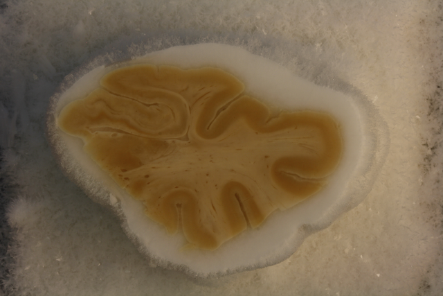

# Data Organization
This document describes how to prepare data and run all the scripts for generating a 3D reconstruction of histology and derived maps using 7T and 9.4T MRI. Please refer to the paper for overall flow of the approach. 

For the purposes of this document we will use variable `${id}` as the example subject identifier, and `${block}` as the example block identifier.

## Set up directory structure

At the root of your directory tree, create the following directories:

    input                    : Input MRI and histology data organized here
    manifest                 : Manifest files summarizing the data/parameters
    manual                   : Manual steps are performed here
    scripts                  : Clone this repo here
    work                     : All the work directories are created here

## Preparing the 7T MRI

* Perform the [3D printing process](make_molds.md)
* Organize the images generated during 3D printing as follows:

      input/${id}/mold_mri/mtl7t.nii.gz          
      input/${id}/mold_mri/contour_image.nii.gz 
      input/${id}/mold_mri/slitmold.nii.gz 
      input/${id}/mold_mri/holderrotation.nii.gz 
      
## Preparing the 9.4T MRI

* Convert the 9.4T MRI to NIFTI format
* Place the image here:

      input/${id}/hires_mri/${id}_mri_hires.nii.gz
      
## Preparing the blockface images

* The blockface images are `.jpg` files and all blockface images for each block should be placed in the folder

      input/${id}/blockface/${block}/
  
  with the following naming convention:
  
      ${id}_${block}_05_08.jpg
      
  where the first number is the section number (each section is 500um) and the second number is the slide number (each slide is 50um). Numbering starts at 1. Slide 10 in each section is the Nissl slide, and typically slide 9 is the Tau slide. Typical blockface image is 3000x4000 pixels in size and looks like this:
  
  

## Preparing the histology data

* Organizing the histology data is the hardest part of the process. Here we describe what must be provided for the `recon.sh` scripts, but some of these data will require their own scripts to be run. Each histology slide will have a unique name. Name is arbitrary, but ideally it would contain the specimen, block, section and stain in the name. For example:

      S01_HR1a_NISSL_05
    
  Here we refer to this name as `${slide}`
    
* Each slide should have an input directory

      input/${id}/histo_proc/${slide}
      
* This directory contains the following files:
  
      preproc/${slide}_metadata.json                  # Slide metadata
      preproc/${slide}_rgb_40um.nii.gz                # Medium-resolution RGB image of slide
      preproc/${slide}_thumbnail.tiff                 # Smallish (1000pix) thumbnail

* For Nissl slides, it should contain these files:

      preproc/${slide}_deepcluster.nii.gz             # DeepCluster output for slide

* For tau slides, it should contain these files:

      density/${slide}_Tau_tangles_densitymap.nii.gz  # Tau burden map from WildCat
      
* To see how these files are generated, see [Histology Processing](svs_to_cloud.md)
  
Additional details on these files are provided below.

### Slide metadata file

* `preproc/${slide}_metadata.json` contains slide metadata, as generated by OpenSlide. Here is an example file:
 
      {
        "level_downsamples": [1.0, 2.0, 4.0, 8.000258431321877], 
        "spacing": [0.0004, 0.0004], 
        "dimensions": [61916, 71904], 
        "level_dimensions": [[61916, 71904], [30958, 35952], [15479, 17976], [7739, 8988]], 
        "level_count": 4
      }

### Other Image Files

* `preproc/${slide}_rgb_40um.nii.gz` is a 3-component NIFTI image with red, green, and blue channels. It has the pixel size of 40 microns, so 1000-2000 pixels across.

* `preproc/${slide}_thumbnail.tiff ` is a thumbnail generated by OpenSlide and is 1000 pixels across in either width or height.

* `preproc/${slide}_deepcluster.nii.gz` is a 20-channel image that is generated by running the Nissl DeepCluster processing pipeline. It's dimensions are 1/256 of the raw histology slide. Every pixel represents a 20-feature representation of the 256x256 patch from the raw Nissl image.

* `density/${slide}_Tau_tangles_densitymap.nii.gz` is a scalar density map derived by running the WildCat classifier on the whole-slide image.

`