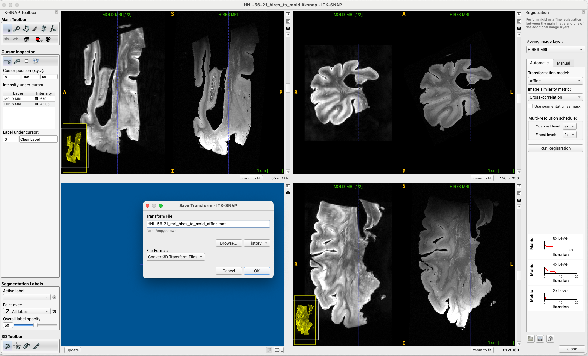
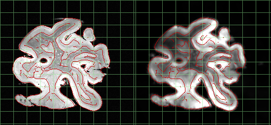
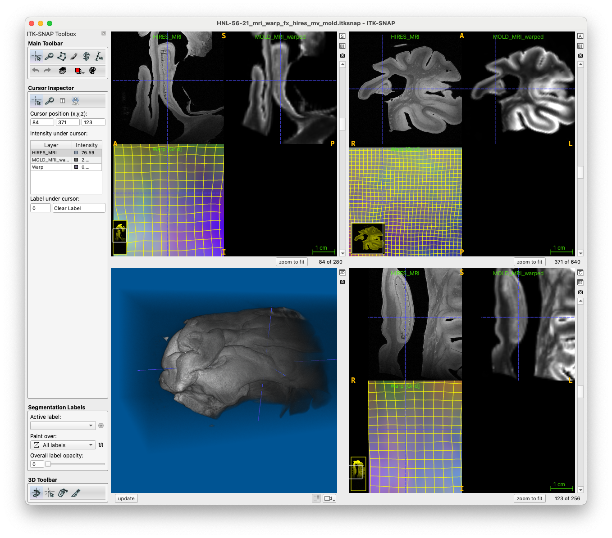

# Running 3D Reconstruction

This tutorial goes over the 3D reconstruction process. We will use the case HNL-56-21 as the example here. Make sure you have completed the [data organization](organize_data_pmacs) step first!

After each step, you can check if progress has been made by running
```sh
./recon.sh check_specimen_results HNL-56-21
```
This will show which reconstruction files have been successfully generated. 

## Check the inputs

Make sure that the necessary inputs are present. Run 
```sh
./recon.sh check_specimen_inputs HNL-56-21
```
and make sure that
* All MRI inputs are green (7T, 9.4T)
* All blockface images are green
* For histology, at the very least you have:
  * NISSL preprocessed 
  * NISSL deepcluster

## Generate masks for histology

Run this command to generate foreground masks for all the histology slides in your project. 

```sh
./recon.sh preproc_histology_all HNL-56-21
```

## MRI processing (7T to 9.4T registration)
There are two scenarios:

* Older scenario, including new HNL cases, where the MTL is scanned at 7T and this 7T scan is used to create the mold. These cases require manual affine registration between 7T and 9.4T.

* Newer scenario, where the mold is generated from the 7T hemisphere scan and 9.4T scan together. For these existing registration files can be used. **TO BE WRITTEN**.

### Case 1: Mold generated from 7T MTL MRI

First, create a workspace to perform manual registration.

```sh
./copy_input.sh setup_manual_mri_regs HNL-56-21
```

This will create a workspace `$ROOT/input/HNL-56-21/HNL-56-21_hires_to_mold.itksnap` that you can open and perform registration with. Open this workspace in ITK-SNAP (see [helpful hint](ref:workspace-to-local)) and perform registration. Then save the resulting affine matrix file to `manual/HNL-56-21/hires_to_mold/HNL-56-21_mri_hires_to_mold_affine.mat`.



Run the `check_results` command to make sure that file is in the right place (shows up green).

```sh
./recon.sh check_specimen_results HNL-56-21
# expected output:
# === Checking MRI registration (process_mri_all) ===
# 9.4T to 7T MRI manual affine:   manual/HNL-56-21/hires_to_mold/HNL-56-21_mri_hires_to_mold_affine.mat
```

Now run the full registration pipeline (affine and deformable registration):

```sh
./recon.sh process_mri_all HNL-56-21
```

* When completed, check the QC image `work/HNL-56-21/qc/HNL-56-21_mri_hires_to_mold.png`, the red lines from the 7T MRI (right) should line up with the edges on the 9.4T MRI (left).



* Optionally, check the output workspace `work/HNL-56-21/mri/HNL-56-21_mri_warp_fx_hires_mv_mold.itksnap`, which should look like this:




## Run blockface reconstruction

This command will generate 3D reconstruction from blockface images. 

```sh
./recon.sh recon_blockface_dc_all HNL-56-21
```

 