# Running 3D Reconstruction

This tutorial goes over the 3D reconstruction process. We will use the case HNL-56-21 as the example here. Make sure you have completed the [data organization](organize_data_pmacs) step first!

After each step, you can check if progress has been made by running
```sh
./recon.sh check_specimen_results HNL-56-21
```
This will show which reconstruction files have been successfully generated. 

## Check the inputs

Make sure that the necessary inputs are present. Run 
```sh
./recon.sh check_specimen_inputs HNL-56-21
```
and make sure that
* All MRI inputs are green (7T, 9.4T)
* All blockface images are green
* For histology, at the very least you have:
  * NISSL preprocessed 
  * NISSL deepcluster

## Generate masks for histology

Run this command to generate foreground masks for all the histology slides in your project. 

```sh
./recon.sh preproc_histology_all HNL-56-21
```

## MRI processing (7T to 9.4T registration)
There are two scenarios:

* Older scenario, including new HNL cases, where the MTL is scanned at 7T and this 7T scan is used to create the mold. These cases require manual affine registration between 7T and 9.4T.

* Newer scenario, where the mold is generated from the 7T hemisphere scan and 9.4T scan together. For these existing registration files can be used. **TO BE WRITTEN**.

### Case 1: Mold generated from 7T MTL MRI

First, create a workspace to perform manual registration.

```sh
./copy_input.sh setup_manual_mri_regs HNL-56-21
```

This will create a workspace `$ROOT/input/HNL-56-21/HNL-56-21_hires_to_mold.itksnap` that you can open and perform registration with. Open this workspace in ITK-SNAP (see [helpful hint](ref:workspace-to-local)) and perform registration. Then save the resulting affine matrix file to `manual/HNL-56-21/hires_to_mold/HNL-56-21_mri_hires_to_mold_affine.mat`.

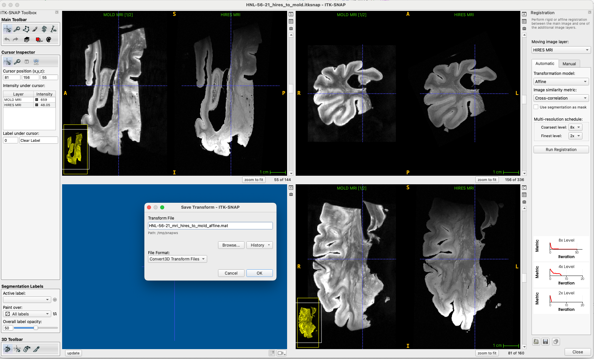

Run the `check_results` command to make sure that file is in the right place (shows up green).

```sh
./recon.sh check_specimen_results HNL-56-21
# expected output:
# === Checking MRI registration (process_mri_all) ===
# 9.4T to 7T MRI manual affine:   manual/HNL-56-21/hires_to_mold/HNL-56-21_mri_hires_to_mold_affine.mat
```

Now run the full registration pipeline (affine and deformable registration):

```sh
./recon.sh process_mri_all HNL-56-21
```

* When completed, check the QC image `work/HNL-56-21/qc/HNL-56-21_mri_hires_to_mold.png`, the red lines from the 7T MRI (right) should line up with the edges on the 9.4T MRI (left).

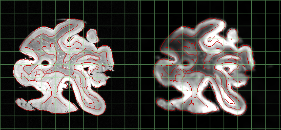

* Optionally, check the output workspace `work/HNL-56-21/mri/HNL-56-21_mri_warp_fx_hires_mv_mold.itksnap`, which should look like this:

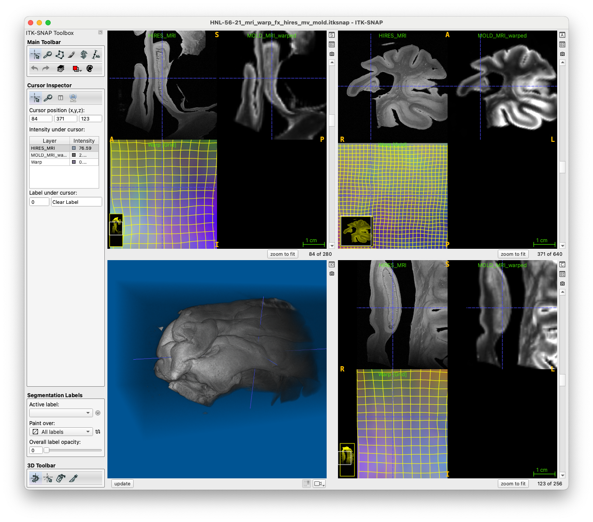


## Run blockface reconstruction

This command will perform rough automatic segmentation of blockface images and generate 3D reconstruction. 

```sh
./recon.sh recon_blockface_dc_all HNL-56-21
```

After this is complete, inspect the workspaces like `$ROOT/work/HNL-56-21/HNL-56-21_HL4p_bfdc_splat_init.itksnap` and ensure that the segmentation and MRI-like image is reasonable. If not, you may want to train a custom random forest classifier for this sample.

(custom_bf_classifier_train)=
## Training a custom random forest classifier

To train a random forest classifier for one of the blocks, you need to open the RGB image (e.g.,`$ROOT/work/HNL-56-21/bfdc/HL4p/HNL-56-21_HL4p_bfdc_splat_init_rgb.nii.gz`) in ITK-SNAP and enter automatic segmentation mode (with whole image as ROI). Then select "classification" presegmentatoin mode. 

* Set classifier properties using the "More..." button as shown
* Draw samples of gray matter (label 1), white matter (label 2), and ice/background (label 3) as shown below
* Under the "More..." dialog, save your samples as `HL4p_samples.nii.gz` and copy this file to the location `$ROOT/manual/HNL-56-21/bfdc_rftrain` (create the directory)

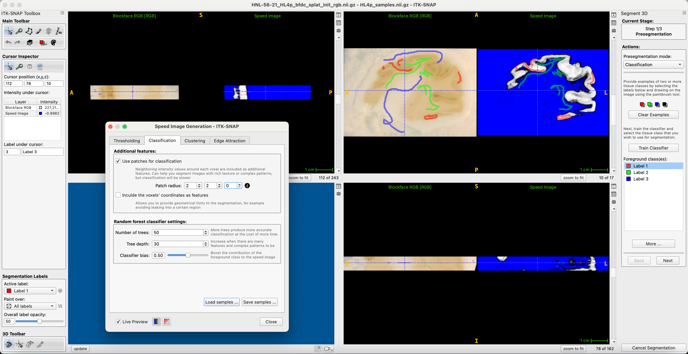

Now, to train the classifier, run

```sh
./recon.sh train_custom_blockface_dc_classifier HNL-56-21 HL4p
```

You can also use this classifier for other blocks in the specimen. To do this, use this command to create symbolic links between blocks (block 3 will use the classifier you trained for block 4):

```sh
./recon.sh link_custom_blockface_dc_classifier HNL-56-21 HL4p HL3a
```

Now, rerun the `recon_blockface_dc_all` command and confirm that the segmentations are better than before. If not, try doing additional training!

(initial_blockface_workspace)=
## Compute initial blockface to MRI matching

### Running the script

Edit the file `$ROOT/manifest/moldmri_src.txt` and make sure that the fourth column for your specimen is set to `0` initially. This tells the initial matching script to try both ways of flipping the mold images relative to the MRI.

```
HNL-51-19 mold01 ASL 0
HNL-52-19 mold01 ASL 0
HNL-53-19 mold01 ASL 0
HNL-54-20 mold01 ASL 1
HNL-56-21 box ASL 0
```

Run the initial automated matching script:

```sh
./recon.sh match_blockface_to_mri_initial_all HNL-56-21
```

Open the workspace `manual/HNL-56-21/bfdc_to_mold/HNL-56-21_mri_bfdc_to_mold_input.itksnap`, which will contain the results of the initial mapping. 

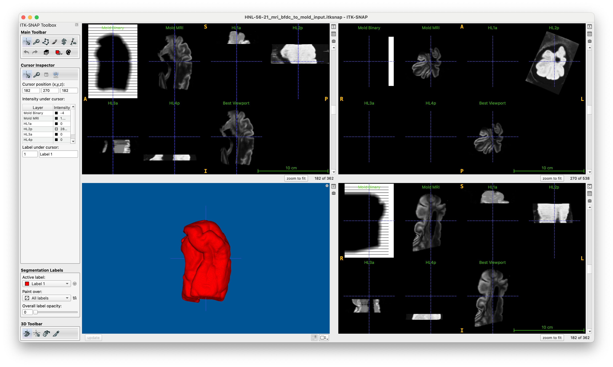

### Manually adjusting the workspace

*This is best done using a network-mounted PMACS drive (e.g., Mountain Duck or SMB: mount)*

Open the workspace `$ROOT/manual/HNL-56-21/bfdc_to_mold/HNL-56-21_mri_bfdc_to_mold_input.itksnap`

Carefully match up each blockface image to the MRI:
  * The blockface-derived images for each block need to be roughly aligned with the mold MRI image. 
  * The images should already be correctly aligned in the longitudinal (z) dimension, but they may need to be shifted to align better with the slits in the mold.
    * If the blockface images appear flipped, you may need to rerun `match_blockface_to_mri_initial_all` command with explicit flip value (1, or -1) set in `$ROOT/manifest/moldmri_src.txt`
  * Use ITK-SNAP registration mode (selecting each block in turn)
    * Move around in z so that the ends of the block line up with slits (never perfect, helps to set z translation to integer values, usually divisible by 2)
    * Try to match up the block rotation in-plane as well
  * Select the “Best Viewport” image in the registration panel and rotate it in the coronal view into correct anatomical orientation (red circle below) as you would like it shown in figures

Save the finished workspace `$ROOT/manual/HNL-56-21/bfdc_to_mold/HNL-56-21_mri_bfdc_to_mold_result.itksnap`

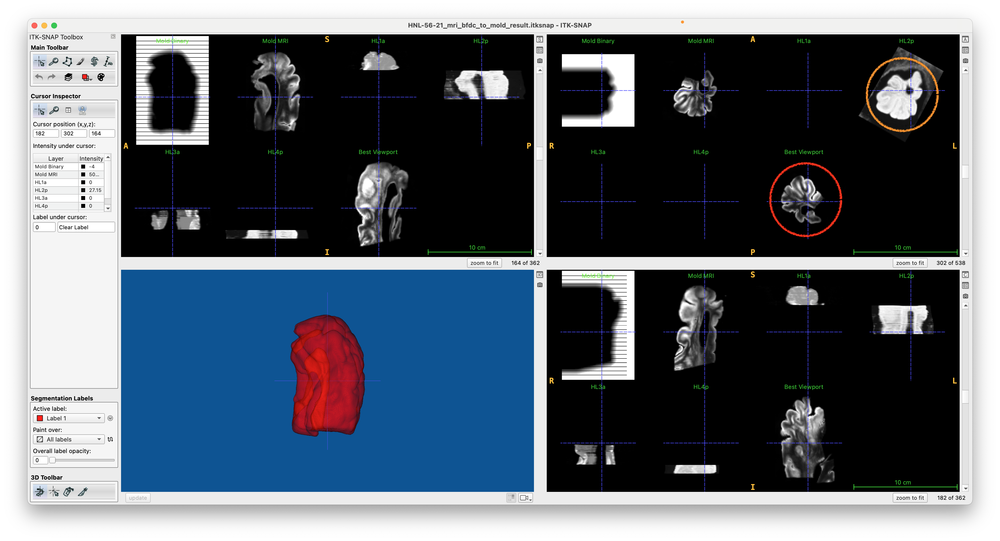

## Run blockface to MRI registration

The following command will perform affine and deformable registration between MRI and blockface images using the initialization you provided, over many iterations.

```sh
./recon.sh register_bfdc_to_mri_all HNL-56-21
```

Registration results are stored in workspaces like `$ROOT/work/HNL-56-21/bfreg/HL1a/HNL-56-21_HL1a_mri_to_bfvis.itksnap`. Open each of these workspaces and make sure they look ok, particularly that the final registration matches up well with the blockface image.

In the example below, I used volume rendering to help check registration quality

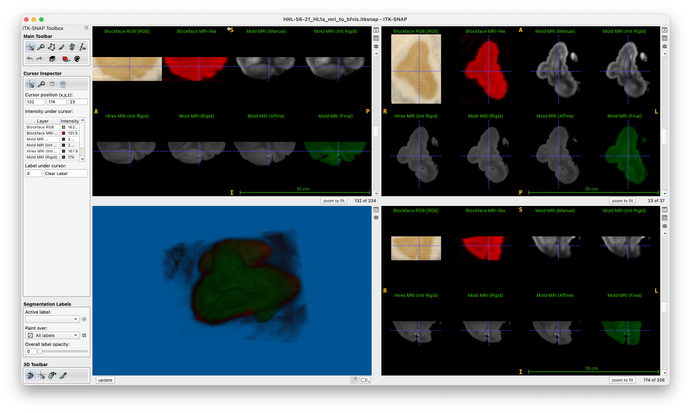

If the registration is not good, the ways to improve it are:
* Try a [better initialization](ref:custom_bf_classifier_train)
* Try [training a custom classifier](ref:initial_blockface_workspace) for the blockface images


## Histology Mask Generation

This is a simple step that generates foreground masks for all the histology images, including IHC. Make sure to run this before the histology-to-MRI and IHC-to-Nissl registration scripts. 

```sh
./recon.sh preproc_histology_all HNL-56-21
```

The outputs are generated in folders such as `work/HNL-29-18/histo_proc/HNL-29-18_HL2a_PV_15/HNL-29-18_HL2a_PV_15_mask.nii.gz`. They match the downsampled slides in `input/HNL-29-18/histo_proc/HNL-29-18_HL2a_PV_15/preproc/HNL-29-18_HL3a_PV_19_rgb_40um.nii.gz`


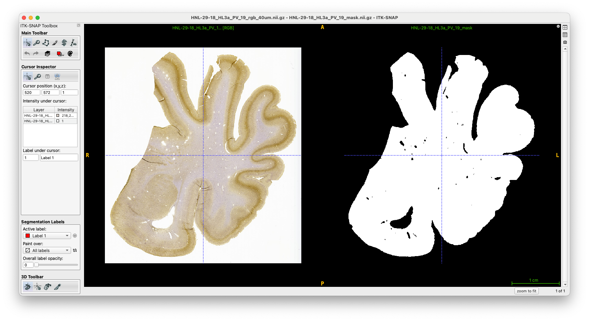


## MRI-Guided Nissl 3D Reconstruction

This is one of the main steps in the pipeline, where consecutive Nissl slices are registered to the corresponding MRI slices and to their neighbors in an iterative fashion.

Run this step using the command below. It will take 1-2 hours to complete.

```sh
./recon.sh recon_histo_all HNL-56-21
```

The script will generate QC screenshots in `work/<specimen>/qc/nissl_to_mri`, like the ones below. The left panel shows the MRI image with some extracted edges; the second panel shows the defomed NISSL image, the third panel shows the affine-registered NISSL image, and the last panel shows annotations used for measuring registratino performance, if available.

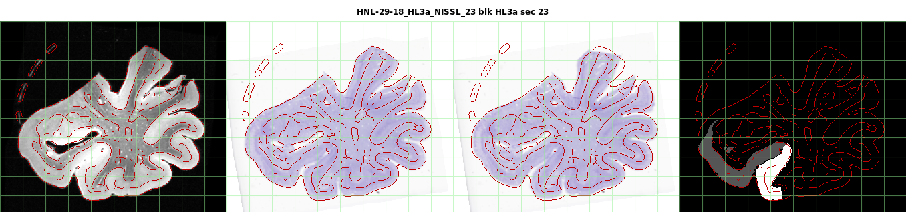

Additionally, this script will generate 3D reconstructed NISSL images and workspaces in `work/<specimen>/historeg/<block>/splat` folder. While the full workspace may take a long time to load, just visualizing the MRI image (`<specimen>_<block>_annot_mri_hires.nii.gz`) with overlaid reconstructed MRI-like (MRI derived from Nissl intensity) image (`<specimen>_<block>_nissl_mrilike_splat_voliter-20.nii.gz`), as shown below, is a good way to appreciate the reconstruction quality:

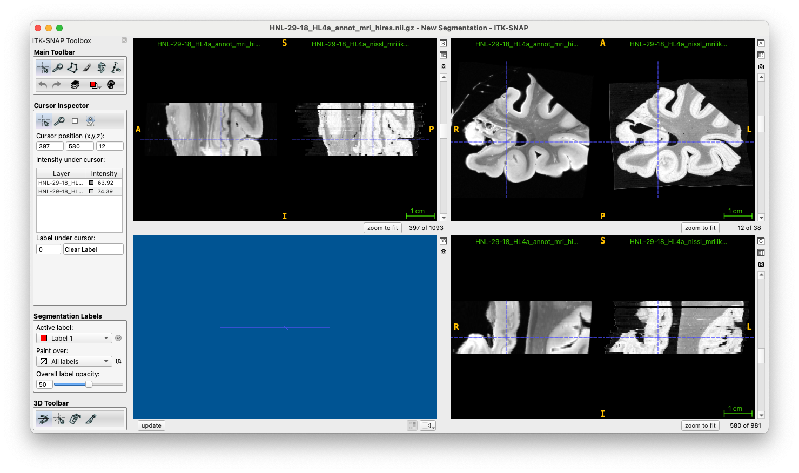

**Troubleshooting:** If registration fails, check the files in `work/<specimen>/historeg/<block>/recon/vol/iterXY` for `.txt` files with NaNs. This may mean that a histology slide is causing registration errors crashing the pipeline. To exclude a slide from registration, add it to the file `manual/common/qc_manifest/nissl_reg_exclude_manifest.csv`. You will have to rerun the pipeline after this step.

## IHC to Nissl Registration

This step will perform piecewise deformable registration between IHC slides and Nissl slides. This is necessary before IHC can be reconstructed in 3D. You specify the stain (PV in the example) and a regular expression for the specimens on which to run.

```sh
./recon.sh match_ihc_to_nissl_all PV HNL-56-21
```

The script will generate QC screenshots in `work/qc/ihc_reg_<stain>`, like the ones below. The first example is of a high quality registration:

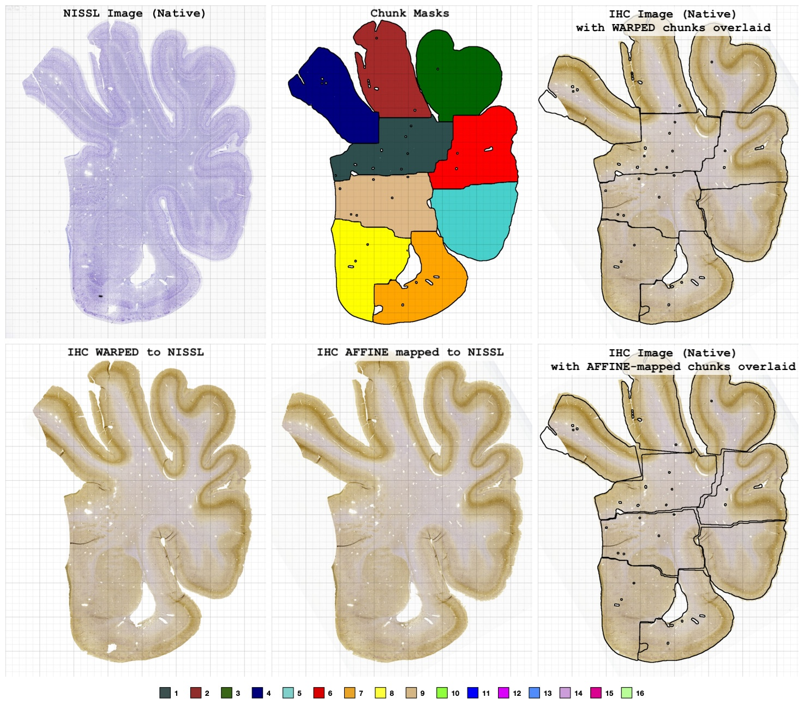

The second example is of a worse registration, where part of the image didn't match well:

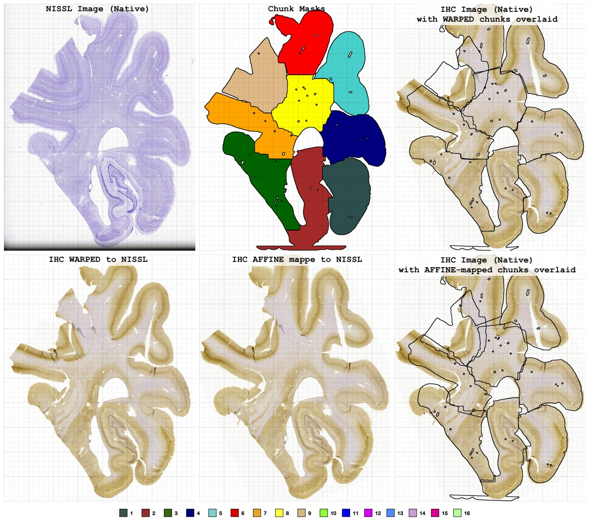

### Fixing common registration problems

It is possible to change the number of chunks into which a slide is divided if you think that this might provide a better registration result. This is specified in the file `manifest/ihc_nissl_reg.csv`. The file looks like this, and the last two columns are used to specify the number of chunks, and also whether the IHC should be forced to be flipped relative to the Nissl. Options are `flip` (allow search over flips when initializing rigid registration) and `any` (do not allow search over flips).

```csv
ID,BLOCK,STAIN,SECTION,NCHUNKS,FLIP
HNL-46-19,HL2p,Tau,10,8,flip
```

It is also possible to manually initialize the registration between the IHC and NISSL slides. To do this, load the NISSL slide (`input/<specimen>/histo_proc/<slide>/preproc/<slide>_rgb_40um.nii.gz`) as the main image in ITK-SNAP, load the IHC (`input/<specimen>/histo_proc/<slide>/preproc/<slide>_rgb_40um.nii.gz`) as the overlay, perform registration, and save the registration matrix as `manual/<specimen>/ihc_reg/<slide>_to_nissl_manual_rigid.mat`. Then rerun the IHC registration.

To rerun registration for a single stain/slide, you can run the command below. On the BSC cluster, make sure to do this on a compute node (`ibash` to get an interactive session):

```sh
./recon.sh match_ihc_to_nissl_slice HNL-56-21 HR2a PV 24
```

### Ignoring failed registrations/chunks in 3D recon

Furthermore, chunks or whole slides can be excluded from the 3D reconstruction. For instance, in the example above, we would exclude the beige chunk (9) from the reconstruction because it didn't match to anything. This can be entered into the file `manual/common/qc_manifest/<stain>_to_nissl_qc_manifest.csv`, which looks like this:

```csv
Specimen,Block,Section,Chunks,Notes,,,
HNL-46-19,3a,22,2/3,minorly disjointed in CS,,,
HNL-48-19,1a,2,3,"entirely missing chunk 3 which is present on both slices, could try to re-register",,,
HNL-48-19,1a,4,all,registration completely failed - one piece looks like it has been rotated differently in tau vs. nissl,,,
HNL-48-19,1a,6,all,"registration completedly failed, images look like they are flipped (placed on slide on oppsoite sides?)",,,
```

The chunks listed in the `Chunks` column as `3`, `2/3`, or `all` will be excluded from the reconstruction.

After editing the `<stain>_to_nissl_qc_manifest.csv` file, the code for 3D reconstruction of the registered IHC images needs to be rerun. This can be run using the command 


```sh
./recon.sh match_ihc_to_nissl_finalize_all PV HNL-56-21
```


### Visualizing IHC-MRI registration in 3D

The reconstructed PV image can be found in `work/<specimen>/ihc_reg/<block>/reg_<stain>_to_NISSL/<specimen>_<block>_splat_<stain>_rgb.nii.gz`. This file matches up with the MRI image in `work/<specimen>/bfreg/<block>/<specimen>_<block>_hires_mri_to_bfvis_warped.nii.gz`, as seen in the image below:

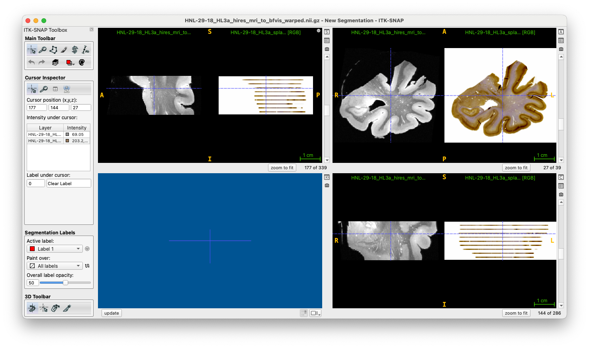


## Generating 3D WildCat density reconstructions

This is the step that will bring everything together and generate 3D maps of Wildcat-derived measures (like tau density) at block and whole specimen level. 

**The first step** is to do run a quick preprocessing script. This orients the MRI in a way that is friendly to visualization:

```sh
./recon.sh merge_preproc_all HNL-56-21
```

This will generate the file `work/<specimen>/recon_native/<specimen>_mri_hires_vis.nii.gz` which is the whole specimen in correct anatomical orientation. Additionally, it will generate a mask  `work/<specimen>/mri/<specimen>_mold_mri_mask_vis.nii.gz`


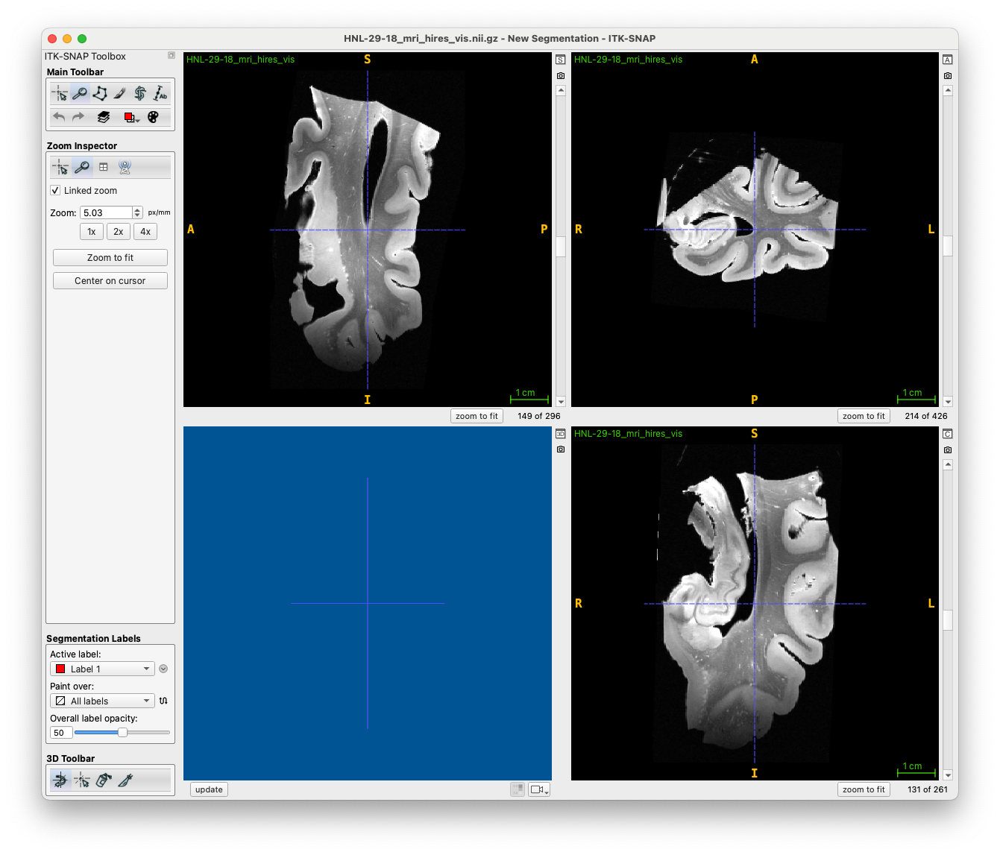

**The second step** is to ``splat'' the Wildcat-derived density maps into block MRI space. This is done using command

```sh
./recon.sh splat_density_all <stain> <model> <contrast> <specimen>
```

Refer to the file `manifest/density_param.json` for models and contrasts that are available. You can use regular expressions for `<stain>`, `<model>`, `<contrast>` and `<specimen>`. For `<stain>`, `<model>`, and `<specimen>` you can also pass the special keyword `all'. Some example commands are:

```sh
./recon.sh splat_density_all Tau tangles main 'HNL-46-19|HNL-50-19'
./recon.sh splat_density_all PV core core HNL-46-19
```

**The third step** is to merge the splatted density images into the whole specimens space. 

```sh
./recon.sh merge_whole_specimen_all <vis|raw> <regex>
```

This will merge all the available densities. For the first parameter, select `vis` to reconstruct into the visualization space (for making figures, etc) and `raw` to map to the original MRI space (e.g., for using with Sadhana's atlas). 
