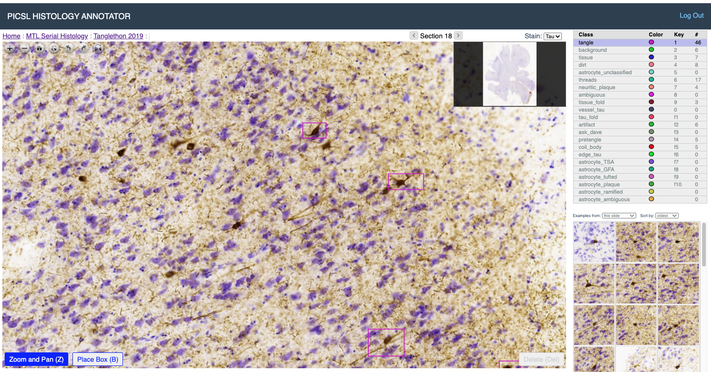

# WildCat Classifier Training and Application

The [*WildCat*](https://github.com/durandtibo/wildcat.pytorch) weakly supervised learning algorithm is used for tangle (and other object) detection and burden mapping on whole-slide histology images. This document describes how to train and apply WildCat.

* [*PICSL Histology Annotation Server (PHAS)*](https://github.com/pyushkevich/histoannot) is used to place training samples.
  * We assume your PHAS server is accessible at `https://my.histoannot.url`
* A Linux machine or VM with an NVidia GPU is required for training
* [*Jupyter notebooks*](https://jupyter.org) are used to train and validate classifiers

## Patch download and organization

### Overview

* Training should be performed by creating a project on the [*PICSL Histology Annotation Server (PHAS)*](https://github.com/pyushkevich/histoannot), defining a task and a labelset, and placing boxes around inclusions of interest. 

  

### Download patches

1. Clone the repository [https://github.com/pyushkevich/tanglethon-ipynb](https://github.com/pyushkevich/tanglethon-ipynb). 

2. Create a root directory for patch download. Here we refer to it as `$PATCH_ROOT`

3. The script `scripts/clone_samples` is used to download samples from PHAS:

        clone_samples: download training samples from a histoannot server
        usage:
          clone_samples.sh [options]
        options:
          -s <url>    Server URL (default: https://histo.itksnap.org)
          -k <file>   Path to JSON file with your API key
          -t <int>    Task ID on the server
          -o <dir>    Output directory for the samples
          
4. Obtain a key from your PHAS server by navigating to URL `https://my.histoannot.url/auth/api/generate_key` and save in a `.json` file. Here we assume you store it in `~/.histoannot_key.json`. Note that when you navigate to this URL your earlier keys are invalidated.

5. Determine which task to get patches from. On PHAS, the task id is a number that is included in the URL when you select a task. Here we let `$TID` refer to the task id.

6. Clone the samples into the directory `$PATCH_ROOT`

        clone_samples.sh -s https://my.histoannot.url -k ~/.histoannot_key.json -t $TID -o $PATCH_ROOT/patches
        
7. Verify patch organization. You should see a collection of files like these:

        $PATCH_ROOT/patches/all_patches/23409.png
        $PATCH_ROOT/patches/all_patches/23410.png
        ...
        

### Create a WildCat experiment

A training task involves classifying a set of foreground objects vs. a set of background objects. For example, _tangle-like_ objects vs. _non-tangles_. Both foreground and background can include more than one class from PHAS training.

1. The script `scripts/organize_folds` is used to organize samples from PHAS into PyTorch-compatible datasets.

        organize_folds: generate train/val/test folds for samples from histoannot
        usage: 
          organize_folds.sh [options] 
        required options:
          -w <dir>    Working directory (created by clone_samples)
          -e <string> Experiment id/name (folder created in working directory)
          -l <file>   JSON file describing the classes and how they map to labels
        optional:
          -n <int>    Maximum number of samples to include (per fold)
          -t <int>    Max number of samples per class to take for train (2000)
          -v <int>    Max number of samples per class to take for val (1000)
          -T <int>    Max number of samples per class to take for test (0, i.e., all)
          -R <int>    Random seed 
          -s <file>   File listing specimens ids to use for testing. These specimens
                      will not be included in training

1. Determine the set of available labels in your training set. Navigate to (replace `[proj_id]` with actual project ID). 

       https://my.histoannot.url/dtrain/[proj_id]/labelsets
       
   
   
2. Create a `.json` file (e.g., `$PATCH_ROOT/exp01.json`) for your experiment. This file explains how classes on the PHAS server are organized to form foreground/background classes, and which classes on PHAS are ignored. Note the regular expression `".*"` is used to select all PHAS classes that have not been matched to either _tangle_ or _ignore_ categories. The order in which categories are specified matters here. 

        [
          {
            "classname": "tangle",
            "labels": [ "GM_tangle", "GM_pretangle" ],
            "ignore": 0
          },
          {
            "classname": "ignore",
            "labels": [ "ask_expert", "ambiguous" ],
            "ignore": 1
          },
          {
            "classname": "nontangle",
            "labels": [ ".*" ],
            "ignore": 0
          }
        ]
         
3. If you wish to split your specimens into train/test, create a text file `$PATCH_ROOT/exp01_test.txt` listing specimens to be used for testing. You will notice that `clone_samples.sh` created a specimen listing `specimens.txt` it its output directory.        

4. Run the organizing script:

       organize_folds.sh -w $PATCH_ROOT/patches -e exp01 -l $PATCH_ROOT/exp01.json -s $PATCH_ROOT/exp01_test.txt

   When completed you should have the following directory structure containing symlinks to patch `.png` files:
   
       $PATCH_ROOT/patches/exp01/patches/<train|val|test>/<tangle|nontangle>/12345.png
       
## Train WildCat classifier in Jupyter

*Alternatively, you can train the classifier from the command line, see below*

1. Start the Jupyter notebook app 

2. Duplicate, edit and run the notebook `generic-wcu-train.ipynb`. 

   * At the beginning of the "Model Setup" section, change `exp_dir` to point to your experiment data directory (`$PATCH_ROOT/patches/exp01`)
     * You can also change some model training parameters here
   * Run all cells in the notebook. This should train the classifier for 30 epochs and save the model and parameters to the files
   
         $PATCH_ROOT/exp01/models/wildcat_upsample.dat
         $PATCH_ROOT/exp01/models/config.json
   
   * You should expect to have about 95% validation accuracy during traning. Could be lower or higher, of course depending on the type of inclusion being analyzed. 
   
## Evaluate WildCat classifier on test patches

This step is optional but nice to evaluate classifier accuracy and look at the kinds of patches the classifier is failing on.

1. In Jupyter, shutdown all kernels to clear NVidia GPU memory

2. Duplicate, edit and run the notebook `generic-wcu-examine.ipynb`. 

   * At the beginning of the "Validation Setup" section, change `exp_dir` to point to your experiment data directory (`$PATCH_ROOT/patches/exp01`)
   * Also set the `cname_obj` and `cname_bkg` to your object/non-object classes (e.g., "tangle"/"non-tangle")
   * Run all the cells in the notebook
     * This will generate the confusion matrix and ROC plot 
     * It will visualize examples of false positives and false negatives on the test set
     * You will also see sample heat maps generated by WildCat for sample inputs
        
## Evaluate WildCat classifier on whole-slide image

This step is also optional and will take longer. It allows you to explore whole-slide heat maps.

1. In Jupyter, shutdown all kernels to clear NVidia GPU memory

2. Download a whole-slide image that you wish to analyze (we will refer to it as `$WSI_DIR/test_wsi.tiff`). 

   * File must be in pyramidal format readable by [OpenSlide](https://openslide.org/api/python/), see [WSI Processing](wsi_proc.md)
   
3. Duplicate, edit and run the notebook `generic-wcu-scanslide.ipynb`. 

   * At the beginning of the "Experiment Setup" section, change `exp_dir` to point to your experiment data directory (`$PATCH_ROOT/patches/exp01`)
   * In the same cell, change `wsi_file` to point to the whole-slide image `$WSI_DIR/test_wsi.tiff`
   * Run the sections of the notebook:
     * In the "Load WSI", the slide will be loaded
     * In the "Generate burden map" section, the slide will be analyzed patch by patch, generating burden map
     * In the "Visualize burden map" section, different parts of the slide can be plotted with the burden map. You will need to specify the regions of interest for zoomed in burden maps.  
   
     

## Validate WildCat classifier vs. Manual Ratings and Object Counts

Follow these instructions if you would like to compare the quantitative burden measure to manual counts of objects of interest (e.g., tangle counts), and subjective ratings. In the histology annotation platform, set up a new task, as shown below. Large boxes are used to designate areas for validation. They can be assigned labels corresponding to ratings. Small boxes are used to mark all individual inclusions of each type that are being counted.
   
   

When you are ready to perform the evaluation:

1. Clone the samples into the directory `$PATCH_ROOT`. Set `CTID` to the counting task id. Note the -X flag, which will download patches in the size drawn as opposed to default 512x512 patches previously cloned.

        clone_samples.sh -s https://my.histoannot.url -k ~/.histoannot_key.json -t $CTID -o $PATCH_ROOT/counting -X
        
2. Duplicate, edit and run the notebook `generic-wcu-counts.ipynb`. 

3. You will need to set `exp_dir` to the directory where you performed WildCat training, and `cnt_dir` to `$PATCH_ROOT/counting`. You will also need to set the dictionaries `container_labels` and `objects_of_interest_labels` to match the labels used to mark large boxes and individual inclusions that should be included in the counting. Towards the end of the notebook, you will need to set `box_labels` to indicate your rating categories for the large boxes.

## Training WildCat network from the command line

1. Clone the repo [https://github.com/pyushkevich/tangle-cnn-prod](https://github.com/pyushkevich/tangle-cnn-prod)

2. Install required packages 

        pip -r requirements.txt

3. Run training script as follows

        # Run this to see all options for training
        python wildcat_main.py train --help 
        
        # Run this to run with the default options
        python wildcat_main.py train \
           --expdir $PATCH_ROOT/patches/exp01
           
   The script will create a directory `$PATCH_ROOT/patches/exp01/models` containing your trained classifier

## Applying WildCat models in batch mode

1. Clone the repo [https://github.com/pyushkevich/tangle-cnn-prod](https://github.com/pyushkevich/tangle-cnn-prod)

2. Prepare your WSI files for reading by OpenSlide, see [WSI Processing](wsi_proc.md)

3. Run the following script:

        # Run the code
        python -u scan_tangles.py apply \
          --slide $wsi_file \
          --output wsi_burden.nii.gz \
          --network $path_to_model
  
